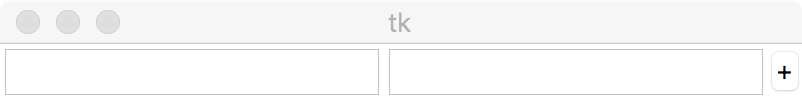

GUI programming
---------------

Now we want to change our CLI program into a GUI program.  We will use
`tkinter <https://docs.python.org/3/library/tk.html>`_ for the GUI version.

GUI programming is a bit different from CLI programming.  CLI programming is
imperative, that is, the code asks the user for input, gets the response,
converts it into an integer, and so on, always in control.  A GUI program
doesn't do that: it draws the graphical elements of the user interface and then
just waits for the user to do something.  These "somethings" the user does,
press a button or enter text, are called `events`.  A GUI program doesn't know
what event will happen next.  This changes the way we program.

Problem Description
-------------------

Write a GUI program that accepts two integers through two Entry widgets and
displays the sum of the two integers when a Button is pressed.

First program
-------------

This program isn't going to look pretty, we just want the basic functionality.
We might make it look more "finished" later.

The simplest way to write the graphical parts of the program is::

    """
    Display the sum of two integers when a button is pressed.
    
    Usage: From_CLI_to_GUI.8.py
    """

    from tkinter import *       # this is bad practice, see later examples

    class App:
        def __init__(self, master):
            frame = Frame(master)
            frame.pack()

            self.integer1 = Entry(frame)
            self.integer1.pack(side=LEFT)

            self.integer2 = Entry(frame)
            self.integer2.pack(side=LEFT)

            self.do_sum = Button(frame, text="+")
            self.do_sum.pack(side=LEFT)

    root = Tk()
    app = App(root)
    root.mainloop()

Don't worry too much about what some of that code is doing just yet, though you
should be able to see where the two Entry widgets and the Button are created.
When we run the code we see this:

Note that nothing works.  You can enter integer values into the Entry widgets,
but pressing the "+" button does nothing.

We will add some functionality on the
`next page <https://github.com/rzzzwilson/PythonEtudes/wiki/From_CLI_to_GUI.9>`_.
